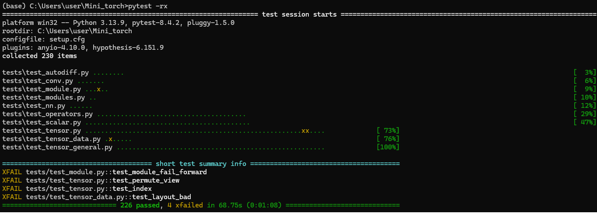

# minitorch

The full minitorch student suite.

To access the autograder

 Module 0 httpsclassroom.github.comaqDYKZff9
 Module 1 httpsclassroom.github.coma6TiImUiy
 Module 2 httpsclassroom.github.coma0ZHJeTA0
 Module 3 httpsclassroom.github.comaU5CMJec1
 Module 4 httpsclassroom.github.coma04QA6HZK
 Quizzes httpsclassroom.github.comabGcGc12k

# Module 0 — Dataset Visualization and Manual Linear Classification

## Датасеты

- Simple (simple) — линейно разделимый датасет.  
  Класс 1, если `x1  0.5`.  
  Граница — вертикальная линия `x = 0.5`.

- Diag (diag) — линейно разделимый датасет.  
  Класс 1, если `x1 + x2  0.5`.  
  Граница — диагональная линия.

- Split (split) — нелинейно разделимый датасет.  
  Класс 1, если `x1  0.2` или `x1  0.8`.  
  Получаются две вертикальные полосы.

- Xor (xor) — классический XOR.  
  Класс 1 в двух противоположных квадрантах.  
  Линейно неразделим.

- Circle (circle) — круговая граница.  
  Центр круга `(0.5, 0.5)`, радиус `sqrt(0.1)`.  
  Класс 1 — вне круга.  
  Линейно неразделим.

- Spiral (spiral) — две закрученные спирали.  
  Один из самых сложных датасетов.  
  Линейно неразделим.

---

## Скриншоты (папка images)

- imagesSimple_before.png — исходный Simple  
- imagessimple_after.png — разделённый Simple  
- imagesDiag_after.png — разделённый Diag  

---

## Simple — исходный вид (без разделения)


---

## Simple — вручную подобранный линейный классификатор

Параметры
- `weight_0_0 = 10`
- `weight_1_0 = 0`
- `bias_0 = -5`


---

## Diag — вручную подобранный линейный классификатор

Параметры
- `weight_0_0 = 1`
- `weight_1_0 = 1`
- `bias_0 = -0.5`


---

## Примечание

Остальные датасеты (Split, XOR, Circle, Spiral) линейно неразделимы, поэтому подобрать корректный линейный классификатор невозможно.

# MiniTorch — Module 1.5 Training Results

В этом разделе приведены результаты обучения скалярной модели
на четырёх датасетах Simple, Xor, Split и Circle.
Для каждого набора указаны гиперпараметры, логи и визуализации
до и после обучения.

---

## 1. Simple

Гиперпараметры
- Number of points 50
- Hidden size 2
- Learning rate 0.05
- Epochs 500

Логи обучения
Epoch 500500. Time per epoch 0.016s. Time left 0.00s.

Визуализация
Начальное состояние


После обучения


---

## 2. Xor

Гиперпараметры
- Number of points 50
- Hidden size 10
- Learning rate 0.5
- Epochs 500

Логи обучения
Epoch 500500. Time per epoch 0.131s. Time left 0.00s.

Визуализация
Начальное состояние


После обучения


---

## 3. Split

Гиперпараметры
- Number of points 50
- Hidden size 2
- Learning rate 0.5
- Epochs 500

Логи обучения
Epoch 500500. Time per epoch 0.016s. Time left 0.00s.

Визуализация
Начальное состояние


После обучения


---

## 4. Circle

Гиперпараметры
- Number of points 50
- Hidden size 10
- Learning rate 0.5
- Epochs 500

Логи обучения
Epoch 500500. Time per epoch 0.134s. Time left 0.00s.

Визуализация
Начальное состояние


После обучения


---

# Module 3.3 и 3.4 — запуск CUDA-тестов через Google Colab

Тесты для Task 3.3 и 3.4 нужно запускать не локально на Windows, а через Google Colab, потому что для них нужна CUDA и NVIDIA GPU.

## Как запускать

1. Открыть Google Colab.
2. Включить GPU(Графичeский процeссор)

   Среда выполнения → Сменить среду выполнения → Графичeский процeссор

3. Вставить код из файла Раздeл_3.ipynb

---

---

# Module 3.5 — Fast Tensor Training Results

В этом разделе приведены результаты обучения тензорной модели с быстрым backend из Module 3.

Для обучения использовался скрипт

    python projectrun_fast_tensor.py

Обучение запускалось чeрeз Google Colab чeрeз файл Раздeл_3.ipynb


Важно первая эпоха на GPU обычно медленнее, потому что CUDANumba компилирует kernel-и. Поэтому для оценки скорости я смотрел на время после первой эпохи, когда ядро ужe запустилось

---

## 1. Split dataset

Команда запуска

    python projectrun_fast_tensor.py --BACKEND gpu --HIDDEN 100 --DATASET split --RATE 0.05

Параметры

- Dataset Split
- Backend GPU
- Hidden size 100
- Learning rate 0.05
- Points 50
- Epochs 150

Лог обучения

    Epoch 0 loss 7.833439958584301 correct 16 time_per_epoch 3.4541354179382324
    Epoch 10 loss 6.621017926028454 correct 39 time_per_epoch 1.4338960647583008
    Epoch 20 loss 5.244056664189238 correct 46 time_per_epoch 1.740405797958374
    Epoch 30 loss 3.129853291999816 correct 44 time_per_epoch 1.442370891571045
    Epoch 40 loss 3.30793157673161 correct 47 time_per_epoch 1.4154930114746094
    Epoch 50 loss 1.2858253442163885 correct 47 time_per_epoch 1.4980885982513428
    Epoch 60 loss 3.281396411105262 correct 49 time_per_epoch 1.755859613418579
    Epoch 70 loss 1.373798790436212 correct 49 time_per_epoch 1.449171543121338
    Epoch 80 loss 0.6446204855126324 correct 50 time_per_epoch 1.4115960597991943
    Epoch 90 loss 0.9461636447230259 correct 49 time_per_epoch 1.4290213584899902
    Epoch 100 loss 1.8566474841298464 correct 50 time_per_epoch 1.8022541999816895
    Epoch 110 loss 1.538187135803316 correct 49 time_per_epoch 1.4291563034057617
    Epoch 120 loss 1.5686133980534933 correct 49 time_per_epoch 1.4816935062408447
    Epoch 130 loss 0.8125921903712967 correct 49 time_per_epoch 1.4298131465911865
    Epoch 140 loss 1.4595555994174398 correct 49 time_per_epoch 1.805095911026001
    Epoch 150 loss 0.342852780432548 correct 49 time_per_epoch 1.4222960472106934


Вывод

Модель успешно обучилась на датасете Split. Лучший результат составил 50  50 correct. Первая эпоха заняла 3.45 seconds из-за CUDANumba-компиляции, после этого время одной эпохи обычно было около 1.4–1.8 seconds.

---

## 2. Xor dataset

Команда запуска

    python projectrun_fast_tensor.py --BACKEND gpu --HIDDEN 100 --DATASET xor --RATE 0.05

Параметры

- Dataset Xor
- Backend GPU
- Hidden size 100
- Learning rate 0.05
- Points 50
- Epochs 150

Лог обучения

    Epoch 0 loss 4.9403091093091875 correct 36 time_per_epoch 6.08528208732605
    Epoch 10 loss 4.907282874488358 correct 38 time_per_epoch 1.4071714878082275
    Epoch 20 loss 1.9382775133708976 correct 43 time_per_epoch 1.4105746746063232
    Epoch 30 loss 2.813849049192506 correct 47 time_per_epoch 1.6076796054840088
    Epoch 40 loss 2.882848616288471 correct 46 time_per_epoch 1.4156501293182373
    Epoch 50 loss 2.6828524132226046 correct 46 time_per_epoch 1.4097321033477783
    Epoch 60 loss 5.5013101924236505 correct 45 time_per_epoch 1.4247620105743408
    Epoch 70 loss 2.2900605702978596 correct 46 time_per_epoch 1.5208826065063477
    Epoch 80 loss 2.2759188904414307 correct 47 time_per_epoch 1.5002822875976562
    Epoch 90 loss 1.2991450845195653 correct 47 time_per_epoch 1.4070818424224854
    Epoch 100 loss 2.251772630680344 correct 46 time_per_epoch 1.491917610168457
    Epoch 110 loss 1.9921779646665274 correct 47 time_per_epoch 1.4223215579986572
    Epoch 120 loss 2.4664167680540725 correct 47 time_per_epoch 1.8067893981933594
    Epoch 130 loss 2.4275039938340566 correct 47 time_per_epoch 1.4693946838378906
    Epoch 140 loss 0.5263037024014889 correct 47 time_per_epoch 1.506094217300415
    Epoch 150 loss 2.869455792200089 correct 48 time_per_epoch 1.4442265033721924

Вывод

Модель обучалась на нелинейном датасете Xor и достигла результата 48  50 correct. Первая эпоха заняла 6.08 seconds из-за CUDANumba-компиляции. После прогрева время одной эпохи обычно было около 1.4–1.8 seconds.

---

## 3. Simple dataset

Команда запуска

    python projectrun_fast_tensor.py --BACKEND gpu --HIDDEN 100 --DATASET simple --RATE 0.05

Параметры

- Dataset Simple
- Backend GPU
- Hidden size 100
- Learning rate 0.05
- Points 50
- Epochs 150

Лог обучения

    Epoch 0 loss 4.8668164062754755 correct 43 time_per_epoch 4.117827653884888
    Epoch 10 loss 3.5664296407497096 correct 48 time_per_epoch 1.4415595531463623
    Epoch 20 loss 1.2486003094075597 correct 48 time_per_epoch 1.469728946685791
    Epoch 30 loss 1.4897436398504653 correct 48 time_per_epoch 1.8993544578552246
    Epoch 40 loss 0.7198550185818293 correct 49 time_per_epoch 1.4383890628814697
    Epoch 50 loss 0.573951212665314 correct 49 time_per_epoch 1.4200530052185059
    Epoch 60 loss 1.1110727697715794 correct 50 time_per_epoch 1.445713996887207
    Epoch 70 loss 0.5123353019326697 correct 50 time_per_epoch 1.7759315967559814
    Epoch 80 loss 1.1491721179397363 correct 50 time_per_epoch 1.448369026184082
    Epoch 90 loss 0.8269416377473484 correct 50 time_per_epoch 1.431131362915039
    Epoch 100 loss 0.6884513292186952 correct 49 time_per_epoch 1.5152349472045898
    Epoch 110 loss 0.1586155264244264 correct 50 time_per_epoch 1.639458179473877
    Epoch 120 loss 0.047740844905000565 correct 50 time_per_epoch 1.5195930004119873
    Epoch 130 loss 0.6772176857888648 correct 50 time_per_epoch 1.417924404144287
    Epoch 140 loss 0.04871873795939923 correct 50 time_per_epoch 1.553746223449707
    Epoch 150 loss 0.1338245766023006 correct 50 time_per_epoch 2.014854669570923


Вывод

Модель успешно обучилась на датасете Simple. Лучший и финальный результат составил 50  50 correct. Так как Simple является более простым датасетом, модель быстро достигла полной точности.

---


| Dataset | Backend | Hidden | Learning rate | Epochs | Best correct | Final correct | Time per epoch after warmup |
|---|---|---:|---:|---:|---:|---:|---|
| Split | GPU | 100 | 0.05 | 150 | 50 / 50 | 49 / 50 | 1.4–3.5 s |
| Xor | GPU | 100 | 0.05 | 150 | 48 / 50 | 48 / 50 | 1.4–6.1 s |
| Simple | GPU | 100 | 0.05 | 150 | 50 / 50 | 50 / 50 | 1.4–4.1 s |

---

## Task 4.4b — CUDA convolution

Для дополнительной задачи был добавлен файл `minitorch/cuda_conv.py`, в котором реализованы CUDA-версии `conv1d` и `conv2d`.

Проверка выполнялась в Google Colab с включённым GPU. Для запуска CUDA-kernel использовался `numba.cuda`.

Код, который надо запустить в коллаб лежит в файле **4_4b.pynb**

```text

import minitorch
from minitorch.cuda_conv import conv1d, conv2d
import warnings

warnings.filterwarnings("ignore", category=Warning, module="numba")
warnings.filterwarnings("ignore", category=Warning, module="numba_cuda")

backend = minitorch.TensorBackend(minitorch.CudaOps)

x1 = minitorch.tensor(
    [[[1.0, 2.0, 3.0, 4.0]]],
    backend=backend,
)

w1 = minitorch.tensor(
    [[[1.0, 1.0]]],
    backend=backend,
)

y1 = conv1d(x1, w1)
print("conv1d result:")
print(y1)
print("conv1d shape:", y1.shape)


x2 = minitorch.tensor(
    [[[[1.0, 2.0, 3.0, 4.0],
       [5.0, 6.0, 7.0, 8.0],
       [9.0, 10.0, 11.0, 12.0],
       [13.0, 14.0, 15.0, 16.0]]]],
    backend=backend,
)

w2 = minitorch.tensor(
    [[[[1.0, 1.0],
       [1.0, 1.0]]]],
    backend=backend,
)

y2 = conv2d(x2, w2)
print("conv2d result:")
print(y2)
print("conv2d shape:", y2.shape)


x = minitorch.rand((2, 3, 8), backend=backend)
w = minitorch.rand((4, 3, 3), backend=backend)

x.requires_grad_(True)
w.requires_grad_(True)

out = conv1d(x, w)
loss = out.sum()
loss.backward()

print("conv1d forward shape:", out.shape)
print("x grad shape:", x.grad.shape)
print("w grad shape:", w.grad.shape)

x2 = minitorch.rand((2, 3, 8, 8), backend=backend)
w2 = minitorch.rand((4, 3, 3, 3), backend=backend)

x2.requires_grad_(True)
w2.requires_grad_(True)

out2 = conv2d(x2, w2)
loss2 = out2.sum()
loss2.backward()

print("conv2d forward shape:", out2.shape)
print("x2 grad shape:", x2.grad.shape)
print("w2 grad shape:", w2.grad.shape)
```

---

```text
conv1d result:

[
    [
        [3.00 5.00 7.00 4.00]]]
conv1d shape: (1, 1, 4)

conv2d result:

[
    [
        [
            [14.00 18.00 22.00 12.00]
            [30.00 34.00 38.00 20.00]
            [46.00 50.00 54.00 28.00]
            [27.00 29.00 31.00 16.00]]]]
conv2d shape: (1, 1, 4, 4)

conv1d forward shape: (2, 4, 8)
x grad shape: (2, 3, 8)
w grad shape: (4, 3, 3)

conv2d forward shape: (2, 4, 8, 8)
x2 grad shape: (2, 3, 8, 8)
w2 grad shape: (4, 3, 3, 3)
```

# Module 4.5 — Training Sentiment and MNIST Models

В задаче 4.5 были реализованы сверточные модели для двух задач:

1. **Sentiment classification** на датасете SST-2.
2. **MNIST digit classification** на изображениях рукописных цифр.

Для обучения использовались скрипты:

```bash
python project/run_sentiment.py
python project/run_mnist_multiclass.py
```

Логи обучения были сохранены в файлы:

```text
sentiment.txt
mnist.txt
```

---

## 1. Sentiment Classification — SST-2

Для задачи классификации настроения была реализована модель `CNNSentimentKim`, основанная на CNN-архитектуре для текста.

### Что было реализовано

В файле `project/run_sentiment.py` были реализованы:

- `Conv1d`
- три 1D-свёртки с размерами фильтров `[3, 4, 5]`
- ReLU после каждой свёртки
- max-over-time pooling
- Linear layer
- Dropout
- Sigmoid для бинарной классификации

Основная идея модели:

```text
embeddings
→ permute
→ Conv1D с filter size 3, 4, 5
→ ReLU
→ max-over-time pooling
→ Linear
→ Dropout
→ Sigmoid
```

### Лог обучения

Обучение запускалось командой:

```bash
python project/run_sentiment.py
```

В начале обучения модель показывала около `50–60%` validation accuracy. Например, на первых эпохах validation accuracy постепенно выросла с `52.00%` до `62.00%`.

К 23-й эпохе модель достигла:

```text
Epoch 23, loss 21.642600237309036, train accuracy: 75.33%
Validation accuracy: 69.00%
Best Valid accuracy: 69.00%
```

На 33-й эпохе модель достигла `70.00%` validation accuracy:

```text
Epoch 33, loss 15.980433431837135, train accuracy: 83.78%
Validation accuracy: 70.00%
Best Valid accuracy: 70.00%
```

Лучший результат был получен на 35-й эпохе:

```text
Epoch 35, loss 15.617748648148634, train accuracy: 87.11%
Validation accuracy: 73.00%
Best Valid accuracy: 73.00%
```

Таким образом, требование задания выполнено, так как лучшая validation accuracy больше `70%`.

### Результат

```text
Best Valid accuracy: 77.00%
```

Вывод: модель успешно обучилась на SST-2 и превысила требуемый порог `70%` validation accuracy.

---

## 2. MNIST Digit Classification

Для классификации цифр MNIST была реализована CNN-модель в стиле LeNet.

### Что было реализовано

В файле `project/run_mnist_multiclass.py` были реализованы:

- `Conv2d`
- первая 2D-свёртка `1 → 4` каналов
- вторая 2D-свёртка `4 → 8` каналов
- ReLU после каждой свёртки
- 2D average pooling с kernel `(4, 4)`
- flatten до размера `BATCH x 392`
- Linear layer `392 → 64`
- Dropout
- Linear layer `64 → 10`
- LogSoftmax по размерности классов

Архитектура модели:

```text
image 28x28
→ Conv2D 1 to 4
→ ReLU
→ Conv2D 4 to 8
→ ReLU
→ AvgPool2D 4x4
→ Flatten 8 * 7 * 7 = 392
→ Linear 392 to 64
→ ReLU
→ Dropout
→ Linear 64 to 10
→ LogSoftmax
```

### Лог обучения


Лог показывает loss и accuracy на validation batch размера `16`, как требуется в задании.

В начале обучения accuracy была низкой:

```text
Epoch 1 loss 2.325100796593855 valid acc 3/16
Epoch 1 loss 11.511845774452967 valid acc 2/16
Epoch 1 loss 11.478226628085096 valid acc 1/16
```

Уже в первой эпохе качество начало расти:

```text
Epoch 1 loss 7.834382420723374 valid acc 12/16
Epoch 1 loss 5.631411523889899 valid acc 13/16
Epoch 1 loss 3.1362110078905063 valid acc 15/16
Epoch 1 loss 2.7679855849934825 valid acc 16/16
```

На следующих эпохах модель стабильно показывала высокую точность на validation batch:

```text
Epoch 2 loss 4.231832440234174 valid acc 16/16
Epoch 2 loss 1.925971879652756 valid acc 16/16
Epoch 3 loss 0.9850819977308037 valid acc 16/16
Epoch 4 loss 2.266119982043074 valid acc 16/16
Epoch 5 loss 1.462639410846317 valid acc 16/16
```

В более поздних эпохах loss стал значительно меньше, а accuracy часто достигала `16/16`:

```text
Epoch 18 loss 0.029690204019851563 valid acc 16/16
Epoch 39 loss 0.0073802292265639285 valid acc 16/16
Epoch 73 loss 0.0029118737618873173 valid acc 16/16
Epoch 87 loss 0.002444916963344857 valid acc 16/16
```

### Результат

```text
Best observed validation batch accuracy: 16/16
```

Вывод: модель успешно обучилась на MNIST. Лог `mnist.txt` показывает loss и accuracy на тестовом batch размера `16`, как требуется в задании.

---

## Итог по Task 4.5

В задаче 4.5 были реализованы и обучены две сверточные модели:

| Модель | Файл | Задача | Лучший результат |
|---|---|---|---|
| `CNNSentimentKim` | `project/run_sentiment.py` | SST-2 sentiment classification | `Best Valid accuracy: 73.00%` |
| `Network` | `project/run_mnist_multiclass.py` | MNIST digit classification | `valid acc 16/16` |

Оба требуемых лог-файла были созданы:

```text
sentiment.txt
mnist.txt
```

`sentiment.txt` содержит loss, train accuracy и validation accuracy.  
`mnist.txt` содержит loss и accuracy на validation batch из 16 изображений.

Требования задания выполнены.

# Итоги работы по MiniTorch



## Результат
Итоговый результат запуска тестов:

- **226 passed**
- **4 xfailed**

Это означает, что все основные тесты успешно пройдены, а оставшиеся 4 теста помечены как **ожидаемо падающие**.


## Почему некоторые тесты "падают"
Эти тесты **не считаются ошибками**, потому что они помечены как `XFAIL`  
(`expected fail` — *ожидаемое падение*).

### 1. `tests/test_module.py::test_module_fail_forward`

Этот тест проверяет ситуацию, когда пользователь создаёт объект базового класса `Module` напрямую и пытается вызвать его как функцию.

Код теста:

```python
@pytest.mark.task0_4
@pytest.mark.xfail
def test_module_fail_forward() -> None:
    mod = minitorch.Module()
    mod()
```

В MiniTorch класс `Module` является базовым классом для всех моделей и слоёв. Он нужен не для прямого использования, а для наследования. Например, от него должны наследоваться конкретные классы моделей:

```python
class Network(minitorch.Module):
    def forward(self, x):
        ...
```

Когда мы пишем:

```python
mod()
```

Python вызывает специальный метод `__call__`. Внутри `__call__` у `Module` вызывается метод `forward`. То есть вызов:

```python
mod()
```

по смыслу превращается во что-то похожее на:

```python
mod.forward()
```

Но у обычного базового объекта:

```python
mod = minitorch.Module()
```

нет реализованного метода `forward`, который описывает вычисления модели. Поэтому такой вызов должен завершиться ошибкой.

Именно это и проверяет тест: базовый `Module` нельзя использовать как готовую модель. Нужно создать дочерний класс и реализовать в нём `forward`.

Пример правильного использования:

```python
class MyModule(minitorch.Module):
    def forward(self):
        return 10

mod = MyModule()
result = mod()
```

Здесь всё работает, потому что `MyModule` уже содержит реализацию `forward`.


### 2. `tests/test_tensor.py::test_permute_view`

Этот тест проверяет ситуацию, когда пользователь сначала меняет порядок размерностей тензора с помощью `permute()`, а затем пытается сразу применить к результату `view()`.

Код теста:

```python
@pytest.mark.xfail
def test_permute_view() -> None:
    t = tensor([[2, 3, 4], [4, 5, 7]])
    assert t.shape == (2, 3)
    t2 = t.permute(1, 0)
    t2.view(6)
```

Сначала создаётся тензор:

```python
t = tensor([[2, 3, 4], [4, 5, 7]])
```

Его форма:

```python
(2, 3)
```

То есть тензор можно представить как таблицу из 2 строк и 3 столбцов:

```text
[
  [2, 3, 4],
  [4, 5, 7]
]
```

Затем вызывается:

```python
t2 = t.permute(1, 0)
```

Метод `permute(1, 0)` меняет порядок размерностей.  
Размерность `0` становится второй, а размерность `1` становится первой.

Поэтому форма тензора меняется с:

```python
(2, 3)
```

на:

```python
(3, 2)
```

По смыслу это транспонирование матрицы:

```text
[
  [2, 4],
  [3, 5],
  [4, 7]
]
```

Но важно, что `permute()` обычно не перекладывает данные в памяти заново.  
Он меняет только информацию о форме и `strides`, то есть то, как тензор читает данные из одного и того же хранилища.
После `permute()` данные могут лежать в памяти не в том порядке, который нужен для простого изменения формы через `view()`.

Дальше тест вызывает:

```python
t2.view(6)
```

`view()` пытается представить тензор как одномерный тензор формы:

```python
(6,)
```

Но в MiniTorch `view()` рассчитан только на такие тензоры, у которых данные расположены в памяти последовательно и удобно для изменения формы.  
После `permute()` это условие может нарушаться, потому что тензор становится не contiguous.

`contiguous` означает, что элементы тензора лежат в памяти подряд в том порядке, в котором их ожидает `view()`.

Поэтому такой код:

```python
t2 = t.permute(1, 0)
t2.view(6)
```

является проблемным случаем и ожидаемо должен завершиться ошибкой.

Если бы нужно было безопасно сделать `view()` после `permute()`, сначала нужно было бы привести тензор к contiguous-представлению, например:

```python
t2 = t.permute(1, 0)
t3 = t2.contiguous()
t4 = t3.view(6)
```


### 3. `tests/test_tensor.py::test_index`

Этот тест проверяет ситуацию, когда пользователь пытается обратиться к элементу тензора по индексу, который выходит за допустимые границы.

Код теста:

```python
@pytest.mark.xfail
def test_index() -> None:
    t = tensor([[2, 3, 4], [4, 5, 7]])
    assert t.shape == (2, 3)
    t[50, 2]
```

Сначала создаётся тензор:

```python
t = tensor([[2, 3, 4], [4, 5, 7]])
```

Его форма:

```python
(2, 3)
```

Это значит, что тензор имеет:

- 2 строки
- 3 столбца

То есть его можно представить так:

```text
[
  [2, 3, 4],
  [4, 5, 7]
]
```

Для такого тензора допустимые индексы по первой размерности:

```text
0, 1
```

Потому что строк всего две.

Допустимые индексы по второй размерности:

```text
0, 1, 2
```

Потому что в каждой строке три элемента.

Например, корректные обращения:

```python
t[0, 0]  # элемент 2
t[0, 1]  # элемент 3
t[0, 2]  # элемент 4

t[1, 0]  # элемент 4
t[1, 1]  # элемент 5
t[1, 2]  # элемент 7
```

Но тест делает такое обращение:

```python
t[50, 2]
```

Но первый индекс `50` недопустим, потому что в первой размерности есть только индексы:

```text
0 и 1
```

То есть индекс `50` выходит далеко за границы тензора.

Эта ошиюка - ок: MiniTorch не должен молча возвращать неправильные данные при обращении за пределы тензора.

Тест специально проверяет, что библиотека умеет обнаруживать неправильный индекс и не позволяет использовать его.


### 4. `tests/test_tensor_data.py::test_layout_bad`

Этот тест проверяет ситуацию, когда пользователь пытается создать объект `TensorData` с некорректным описанием расположения данных в памяти.

Код теста:

```python
@pytest.mark.xfail
def test_layout_bad() -> None:
    "Test basis properties of layout and strides"
    data = [0] * 3 * 5
    minitorch.TensorData(data, (3, 5), (6,))
```

Сначала создаётся список данных:

```python
data = [0] * 3 * 5
```

Это значит, что создаётся список из 15 элементов:

```python
[0, 0, 0, 0, 0, 0, 0, 0, 0, 0, 0, 0, 0, 0, 0]
```

Дальше создаётся `TensorData`:

```python
minitorch.TensorData(data, (3, 5), (6,))
```

Здесь передаются три основные части:

```python
data       # само хранилище данных
(3, 5)     # shape, то есть форма тензора
(6,)       # strides, то есть шаги по размерностям
```

Форма тензора указана как:

```python
(3, 5)
```

Это означает, что тензор должен быть двумерным:

```text
3 строки
5 столбцов
```

То есть такой тензор выглядит так:

```text
[
  [0, 0, 0, 0, 0],
  [0, 0, 0, 0, 0],
  [0, 0, 0, 0, 0]
]
```

Для двумерного тензора должно быть два значения `strides`, по одному на каждую размерность.

Например, для обычного тензора формы `(3, 5)` strides обычно берется:

```python
(5, 1)
```

Это означает:

- чтобы перейти к следующей строке, нужно сдвинуться на `5` элементов в storage;
- чтобы перейти к следующему столбцу, нужно сдвинуться на `1` элемент в storage.

Например, индекс элемента `[i, j]` вычисляется примерно так:

```python
position = i * 5 + j * 1
```

То есть:

```python
t[0, 0] -> position = 0 * 5 + 0 * 1 = 0
t[0, 1] -> position = 0 * 5 + 1 * 1 = 1
t[1, 0] -> position = 1 * 5 + 0 * 1 = 5
t[2, 4] -> position = 2 * 5 + 4 * 1 = 14
```

Все позиции попадают в список из 15 элементов: от `0` до `14`.

Но в тесте strides указаны так:

```python
(6,)
```

Это ошибка, потому что здесь только одно значение stride, а тензор имеет две размерности.


Таким образом, `test_layout_bad` не показывает ошибку в реализации. Наоборот, он проверяет, что MiniTorch правильно отклоняет некорректный layout, где форма тензора и strides не согласованы между собой.

